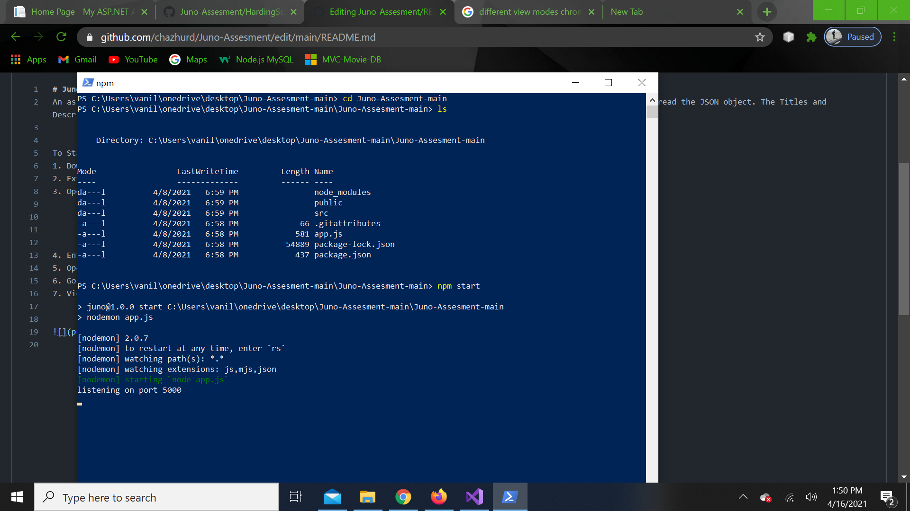
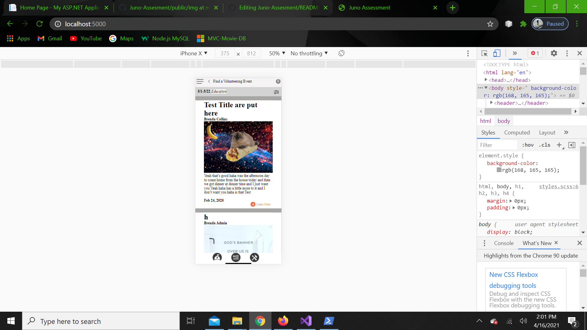

# Juno-Assesment
An assesment from Juno. Involves Node and Express. Reading a JSON object and displaying it in a specific manner. Used PostMan to read the JSON object. The Titles and Descriptions are odd but that what both Postman and Axios got. 

To Start:
1. Download Zip File from GitHub
2. Extract Files to destination
3. Open Powershell and set path to the extracted Folder ( cd Juno-Assesment-main ) 
4. Enter the command "npm start" (Nodemon will create a port @ 5000)

6. Open Chrome ( Firefox's Mobile Mode is not as good ) 
7. Go To LocalHost:5000
9. View the App in Mobile Mode @ 50% Zoom for full ( Ctrl + Shift + M in Dev mode ) 

